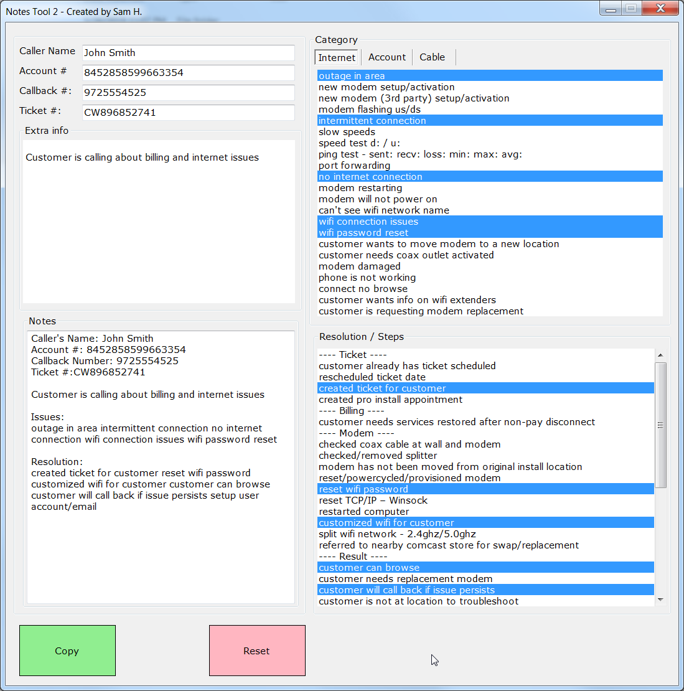

# Note-Tool

>###### This is a note taking tool to help with repetitive data entry tasks.

## Installation

No install required, run the included binary or compile with Visual Studio 2019 (VB.net)

## Usage example
Run NoteTool.exe

To edit the categories just edit the associated text files in the same directory, 'account.txt', 'cable.txt' etc.

## Development setup

Visual Studio 2019 (VB.net)

## Release History

* 0.0.2
    * Second release, work in progress

## Meta

Sam H. – [@shuff_co](https://twitter.com/shuff_co) – syfenx@gmail.com

[https://github.com/syfenx/](https://github.com/syfenx/)

## Contributing

1. Fork it (<https://github.com/syfenx/Note-Tool/fork>)
2. Create your feature branch (`git checkout -b feature/fooBar`)
3. Commit your changes (`git commit -am 'Add some fooBar'`)
4. Push to the branch (`git push origin feature/fooBar`)
5. Create a new Pull Request